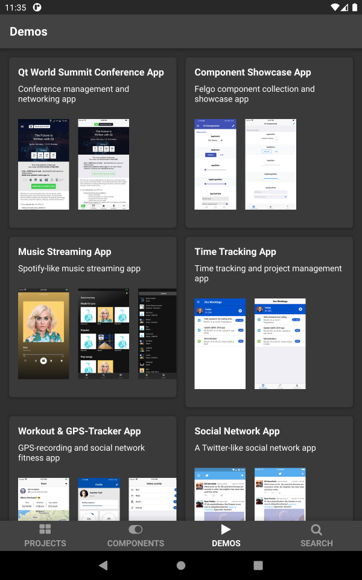
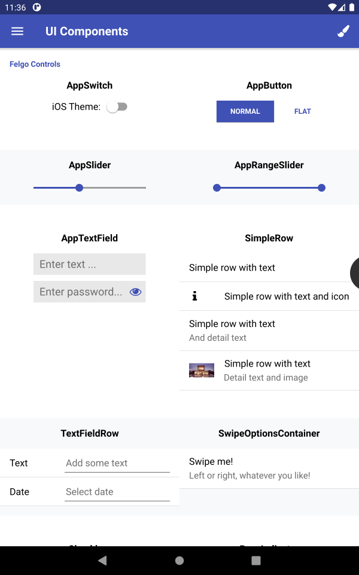

# Felgo Demos & Examples

Felgo offers a number of **open-source** demos and examples.

You may use them as a starting point for your own apps, or just copy parts of it to speed up your development.

## Dev App

You can get a live preview of all included demos with the **Felgo Dev App**:

Download for [Android](https://play.google.com/store/apps/details?id=net.vplay.apps.QMLLive) or [iOS](https://itunes.apple.com/us/app/qt-quick-qml-live-scripting-by-v-play/id1157319191).

Dev App | Component Showcase Demo
:---:|:---:
 | 

## Felgo SDK

The demos are also part of the Felgo SDK. You can download Felgo at https://felgo.com.

# License

The app sourcecode is released under the MIT license.

Permission is NOT granted to merge, publish, distribute, sublicense and/or sell the provided image, audio and video files of this software.

If You have any questions about those Agreements, please write to support@felgo.com or visit https://felgo.com.

---

Copyright FELGO GmbH